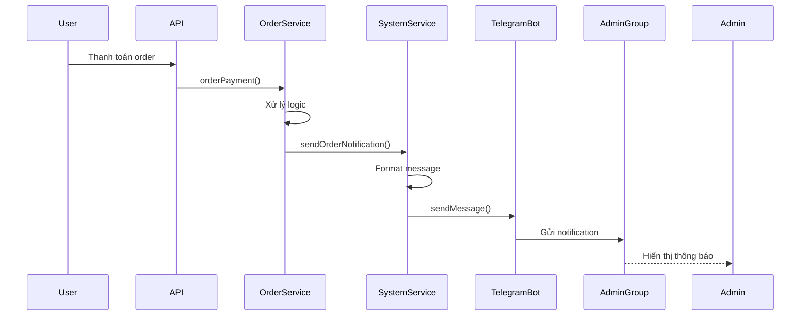

# 📋 KẾ HOẠCH BỔ SUNG TELEGRAM NOTIFICATION CHO ADMIN

> **Yêu cầu**: Bắn thông báo qua Telegram khi có order thành công và yêu cầu đăng ký CTV  
> **Thời gian dự kiến**: 2-3 giờ  
> **Độ ưu tiên**: HIGH

---

## 🎯 MỤC TIÊU

### **Các sự kiện cần thông báo qua Telegram**

| # | Sự kiện | Trigger Point | Độ ưu tiên |
|---|---------|---------------|------------|
| 1 | 💰 **Order thanh toán thành công** | `orders.service.ts` → `orderPayment()` | 🔴 HIGH |
| 2 | 👥 **Đăng ký Cộng Tác Viên** | `ticket.service.ts` → `createTicket()` | 🟡 MEDIUM |

---

## 📊 PHÂN TÍCH HIỆN TRẠNG

### **✅ Đã có sẵn**

1. **Telegram Bot Package**
   ```json
   "node-telegram-bot-api": "^0.66.0"
   ```

2. **SystemService với Telegram methods** (đã tắt)
   - `sendMessenger(message)` - Gửi text message
   - `sendFile(filePath, caption)` - Gửi file
   - `checkSystemVPS()` - Monitor VPS
   - `botTele` instance

3. **Code infrastructure**
   - Constructor đã setup bot (bị comment out)
   - Đã có methods xử lý commands
   - Đã có error handling

### **❌ Cần bổ sung**

1. **Environment variables** (không thấy trong `.env.product`)
   ```env
   TELEGRAM_TOKEN=
   ID_GROUP_CHAT_TELE=
   TELEGRAM_ENABLED=true
   ```

2. **Enable Telegram bot** (hiện đang comment)

3. **Methods mới**
   - `sendOrderNotification()` - Format và gửi thông báo order
   - `sendCTVRequestNotification()` - Format và gửi thông báo CTV

4. **Integration với existing services**
   - Inject `SystemService` vào `OrdersService`
   - Inject `SystemService` vào `TicketService`

---

## 🏗️ KIẾN TRÚC GIẢI PHÁP

### **Architecture Overview**

```
┌─────────────────────────────────────────────────────────┐
│                    TELEGRAM BOT                          │
│                  (SystemService)                         │
└─────────────────────────────────────────────────────────┘
                          ▲
                          │
         ┌────────────────┼────────────────┐
         │                                 │
┌────────▼─────────┐           ┌──────────▼─────────┐
│  OrdersService   │           │  TicketService     │
│                  │           │                    │
│  - orderPayment()│           │  - createTicket()  │
│  → Telegram      │           │  → Telegram        │
└──────────────────┘           └────────────────────┘
```

### **Data Flow**



---

## 📝 CHI TIẾT IMPLEMENTATION

### **PHASE 1: Setup Telegram Bot**

#### **1.1. Environment Configuration**

**File**: `.env.product`, `.env.test`, `.env.development`

```env
# Telegram Bot Configuration
TELEGRAM_ENABLED=true
TELEGRAM_TOKEN=your_bot_token_here
ID_GROUP_CHAT_TELE=your_group_chat_id
TELEGRAM_THREAD_ID=  # Optional: Nếu dùng topic trong group

# Feature Flags
TELEGRAM_NOTIFY_ORDER=true
TELEGRAM_NOTIFY_CTV=true
```

**Cách lấy thông tin:**
1. **TELEGRAM_TOKEN**: 
   - Chat với @BotFather
   - Tạo bot mới: `/newbot`
   - Copy token

2. **ID_GROUP_CHAT_TELE**:
   - Thêm bot vào group
   - Gửi message bất kỳ
   - Call API: `https://api.telegram.org/bot<TOKEN>/getUpdates`
   - Lấy `chat.id` từ response

#### **1.2. Update SystemService**

**File**: `src/system/system.service.ts`

**Các thay đổi cần thực hiện:**

```typescript
// ✅ ENABLE: Uncomment constructor
constructor(private readonly _userService: UsersService, ...) {
    // Check feature flag
    if (process.env.TELEGRAM_ENABLED === 'true') {
        this.botTele = new TelegramBot(process.env.TELEGRAM_TOKEN, { 
            polling: false  // ⚠️ Đổi sang false vì chỉ send, không receive
        });
        this.logger.log('✅ Telegram Bot initialized');
    } else {
        this.logger.warn('⚠️ Telegram Bot is DISABLED');
    }
}

// ✅ ADD: Thêm safety check cho sendMessenger
async sendMessenger(message: string) {
    if (!this.botTele) {
        this.logger.warn('Telegram bot not initialized');
        return;
    }
    
    try {
        await this.botTele.sendMessage(
            process.env.ID_GROUP_CHAT_TELE, 
            message,
            { parse_mode: 'HTML' }  // Support HTML formatting
        );
        this.logger.log('✅ Telegram message sent');
    } catch (error) {
        this.logger.error('❌ Failed to send Telegram message:', error.message);
    }
}
```

---

### **PHASE 2: Order Success Notification**

#### **2.1. Design Message Format**

**Template:**
```
🎉 ĐƠN HÀNG MỚI THANH TOÁN THÀNH CÔNG

📦 Mã đơn: <code>{ORDER_CODE}</code>
💰 Tổng tiền: <b>{TOTAL_PRICE} VND</b>
📅 Thời gian: {DATETIME}

👤 THÔNG TIN KHÁCH HÀNG
├─ Tên: {CUSTOMER_NAME}
├─ SĐT: {CUSTOMER_PHONE}
└─ Email: {CUSTOMER_EMAIL}

🎫 CHI TIẾT ĐẶT CHỖ
├─ Event: {EVENT_NAME}
├─ Showtime: {SHOWTIME}
├─ Ghế J: {J_SIZE} | Ghế Q: {Q_SIZE} | Ghế K: {K_SIZE}
└─ Combo/Items: {COMBO_ITEMS}

💎 Điểm thưởng: +{POINTS} điểm
{PROMOTION_INFO}

🔗 Chi tiết: {FE_URI}/admin/orders/{ORDER_ID}

---
⏰ {TIMESTAMP}
```

**Example output:**
```
🎉 ĐƠN HÀNG MỚI THANH TOÁN THÀNH CÔNG

📦 Mã đơn: ORDER_ABC123XYZ
💰 Tổng tiền: 500,000 VND
📅 Thời gian: 08/12/2024 14:30:25

👤 THÔNG TIN KHÁCH HÀNG
├─ Tên: Nguyễn Văn A
├─ SĐT: 0987654321
└─ Email: nguyenvana@gmail.com

🎫 CHI TIẾT ĐẶT CHỖ
├─ Event: Queen Acoustic Live Show
├─ Showtime: 20:00 - 10/12/2024
├─ Ghế J: 2 | Ghế Q: 1 | Ghế K: 0
└─ Combo/Items: Combo Couple, Pepsi x2

💎 Điểm thưởng: +50 điểm
🎁 Khuyến mãi: GIAMGIA20 (-100,000 VND)

🔗 Chi tiết: https://booking.queenacoustic.vn/admin/orders/123456

---
⏰ 08/12/2024 14:30:25
```

#### **2.2. Implementation Steps**

**File**: `src/system/system.service.ts`

**Thêm method mới:**

```typescript
async sendOrderNotification(orderData: any, userData: any, eventData?: any) {
    if (!this.botTele || process.env.TELEGRAM_NOTIFY_ORDER !== 'true') {
        return;
    }
    
    try {
        // Format price
        const formattedPrice = Number(orderData.total_price).toLocaleString('vi-VN');
        
        // Format datetime
        const datetime = new Date().toLocaleString('vi-VN', {
            day: '2-digit',
            month: '2-digit',
            year: 'numeric',
            hour: '2-digit',
            minute: '2-digit',
            second: '2-digit'
        });
        
        // Build seats info
        const orderItems = orderData.InfoOrderItems?.[0] || {};
        const seatsInfo = [
            orderItems.j_size && `Ghế J: ${orderItems.j_size}`,
            orderItems.q_size && `Ghế Q: ${orderItems.q_size}`,
            orderItems.k_size && `Ghế K: ${orderItems.k_size}`
        ].filter(Boolean).join(' | ') || 'N/A';
        
        // Build combo/items info
        const comboItems = [
            ...(orderItems.combo_info || []).map(c => c.name),
            ...(orderItems.item_upsell || []).map(i => i.item_name)
        ].join(', ') || 'Không có';
        
        // Build promotion info
        const promotionInfo = orderData.promotion 
            ? `\n🎁 Khuyến mãi: ${orderData.promotion.name} (-${Number(orderData.promotion.price).toLocaleString('vi-VN')} ${orderData.promotion.type_price})`
            : '';
        
        // Build message
        const message = `
🎉 <b>ĐƠN HÀNG MỚI THANH TOÁN THÀNH CÔNG</b>

📦 Mã đơn: <code>${orderData.code}</code>
💰 Tổng tiền: <b>${formattedPrice} VND</b>
📅 Thời gian: ${datetime}

👤 <b>THÔNG TIN KHÁCH HÀNG</b>
├─ Tên: ${userData.name}
├─ SĐT: ${userData.phone}
└─ Email: ${userData.email}

🎫 <b>CHI TIẾT ĐẶT CHỖ</b>
├─ Event: ${eventData?.name || 'N/A'}
├─ Showtime: ${eventData?.showtime || 'N/A'}
├─ Ghế: ${seatsInfo}
└─ Combo/Items: ${comboItems}

💎 Điểm thưởng: +${orderData.point_order || 0} điểm${promotionInfo}

🔗 Chi tiết: ${process.env.FE_URI}/admin/orders/${orderData._id}

---
⏰ ${datetime}
        `.trim();
        
        await this.sendMessenger(message);
        
    } catch (error) {
        this.logger.error('Failed to send order notification:', error);
    }
}
```

**File**: `src/orders/orders.service.ts`

**Inject SystemService:**

```typescript
// In constructor
constructor(
    // ... existing dependencies
    private readonly _systemService: SystemService  // ← ADD THIS
) {}
```

**Update orderPayment method:**

```typescript
async orderPayment(orderId: string, orderStatus: OrderStatus) {
    // ... existing code ...
    
    if (orderStatus === OrderStatus.PAID) {
        // ... existing logic ...
        
        orderUpdate = await this.updateOrder1(order._id, dataUpdateOrder);
        
        // ✅ ADD: Send Telegram notification
        try {
            const eventData = await this._eventService.findById(order.event_id);
            const showtimeData = await this._showtimeService.findById(order.showtimes_id);
            
            await this._systemService.sendOrderNotification(
                orderUpdate,
                userOrder,
                {
                    name: eventData?.name,
                    showtime: showtimeData?.time
                }
            );
        } catch (error) {
            this.logger.error('Failed to send Telegram notification:', error);
            // Don't throw - notification failure shouldn't break the flow
        }
        
        // ... rest of existing code ...
    }
}
```

**Update module dependencies:**

**File**: `src/orders/orders.module.ts`

```typescript
@Module({
    imports: [
        // ... existing imports
        SystemModule,  // ← ADD THIS
    ],
    // ...
})
```

---

### **PHASE 3: CTV Registration Notification**

#### **3.1. Design Message Format**

**Template:**
```
👥 YÊU CẦU ĐĂNG KÝ CỘNG TÁC VIÊN MỚI

📋 Mã ticket: <code>{TICKET_ID}</code>
📝 Tiêu đề: {TITLE}
📅 Thời gian: {DATETIME}

👤 THÔNG TIN NGƯỜI GỬI
├─ Tên: {USER_NAME}
├─ SĐT: {USER_PHONE}
├─ Email: {USER_EMAIL}
└─ Điểm hiện tại: {USER_POINTS} điểm

⏳ Trạng thái: <b>PENDING</b> (Chờ duyệt)

🔗 Xem chi tiết: {FE_URI}/admin/tickets/{TICKET_ID}
✅ Duyệt: {BE_URI}/ticket/updateStatusTicker?id={TICKET_ID}

---
⏰ {TIMESTAMP}
```

**Example output:**
```
👥 YÊU CẦU ĐĂNG KÝ CỘNG TÁC VIÊN MỚI

📋 Mã ticket: CTV_12345ABC
📝 Tiêu đề: Đăng ký làm cộng tác viên
📅 Thời gian: 08/12/2024 15:45:30

👤 THÔNG TIN NGƯỜI GỬI
├─ Tên: Trần Thị B
├─ SĐT: 0912345678
├─ Email: tranthib@gmail.com
└─ Điểm hiện tại: 1,250 điểm

⏳ Trạng thái: PENDING (Chờ duyệt)

🔗 Xem chi tiết: https://booking.queenacoustic.vn/admin/tickets/123456
✅ Duyệt: https://backend.booking.queenacoustic.vn/ticket/updateStatusTicker?id=123456

---
⏰ 08/12/2024 15:45:30
```

#### **3.2. Implementation Steps**

**File**: `src/system/system.service.ts`

**Thêm method:**

```typescript
async sendCTVRequestNotification(ticketData: any, userData: any) {
    if (!this.botTele || process.env.TELEGRAM_NOTIFY_CTV !== 'true') {
        return;
    }
    
    try {
        const datetime = new Date().toLocaleString('vi-VN', {
            day: '2-digit',
            month: '2-digit',
            year: 'numeric',
            hour: '2-digit',
            minute: '2-digit',
            second: '2-digit'
        });
        
        const formattedPoints = Number(userData.point || 0).toLocaleString('vi-VN');
        
        const message = `
👥 <b>YÊU CẦU ĐĂNG KÝ CỘNG TÁC VIÊN MỚI</b>

📋 Mã ticket: <code>${ticketData._id}</code>
📝 Tiêu đề: ${ticketData.title}
📅 Thời gian: ${datetime}

👤 <b>THÔNG TIN NGƯỜI GỬI</b>
├─ Tên: ${userData.name}
├─ SĐT: ${userData.phone}
├─ Email: ${userData.email}
└─ Điểm hiện tại: ${formattedPoints} điểm

⏳ Trạng thái: <b>PENDING</b> (Chờ duyệt)

🔗 Xem chi tiết: ${process.env.FE_URI}/admin/tickets/${ticketData._id}

---
⏰ ${datetime}
        `.trim();
        
        await this.sendMessenger(message);
        
    } catch (error) {
        this.logger.error('Failed to send CTV notification:', error);
    }
}
```

**File**: `src/ticket/ticket.service.ts`

**Inject SystemService:**

```typescript
// In constructor
constructor(
    private readonly _ticketRepo: TicketRepo,
    private readonly _userService: UsersService,
    private readonly _mailerService: MailerService,
    private readonly _systemService: SystemService  // ← ADD THIS
) {}
```

**Update createTicket method:**

```typescript
async createTicket(username: string, createTicketDto: CreateTicketDto) {
    const user = await this._userService.findByPhone(username);
    
    // ... existing validation logic ...
    
    const data = {
        _id: id,
        uid: user._id,
        type: createTicketDto.type,
        title: createTicketDto.title,
        price: createTicketDto.price,
    };
    
    const ticket = await this._ticketRepo.createTicket(data);
    
    // ✅ ADD: Send Telegram notification for CTV registration
    if (createTicketDto.type === TypeTicket.COLLABORATOR) {
        try {
            await this._systemService.sendCTVRequestNotification(ticket, user);
        } catch (error) {
            this.logger.error('Failed to send Telegram notification:', error);
            // Don't throw - notification failure shouldn't break the flow
        }
    }
    
    return ticket;
}
```

**Update module:**

**File**: `src/ticket/ticket.module.ts`

```typescript
@Module({
    imports: [
        // ... existing imports
        SystemModule,  // ← ADD THIS
    ],
    // ...
})
```

---

## 🔧 CONFIGURATION & SETUP

### **Step 1: Create Telegram Bot**

```bash
# 1. Mở Telegram và chat với @BotFather
# 2. Gửi command:
/newbot

# 3. Nhập tên bot:
Queen Acoustic Booking Bot

# 4. Nhập username bot (phải kết thúc bằng 'bot'):
queen_booking_bot

# 5. Copy token được cung cấp
# Token format: 123456789:ABCdefGHIjklMNOpqrsTUVwxyz
```

### **Step 2: Get Group Chat ID**

```bash
# 1. Tạo group mới trong Telegram (hoặc dùng group có sẵn)
# 2. Thêm bot vào group
# 3. Gửi một message bất kỳ trong group
# 4. Truy cập URL sau (thay YOUR_BOT_TOKEN):
curl https://api.telegram.org/botYOUR_BOT_TOKEN/getUpdates

# 5. Tìm "chat":{"id": -1234567890,...}
# Copy số chat ID (bao gồm dấu -)
```

### **Step 3: Update Environment Files**

**File**: `.env.product`, `.env.test`

```env
# Telegram Configuration
TELEGRAM_ENABLED=true
TELEGRAM_TOKEN=123456789:ABCdefGHIjklMNOpqrsTUVwxyz
ID_GROUP_CHAT_TELE=-1234567890
TELEGRAM_NOTIFY_ORDER=true
TELEGRAM_NOTIFY_CTV=true
```

### **Step 4: Test Connection**

**Create test endpoint:**

**File**: `src/system/system.controller.ts`

```typescript
@Get('test-telegram')
@Description('Test Telegram notification', [])
async testTelegram() {
    await this._systemService.sendMessenger('🧪 Test message from Booking System');
    return { message: 'Test message sent' };
}
```

**Test:**
```bash
curl http://localhost:3000/system/test-telegram
```

---

## ✅ TESTING CHECKLIST

### **Unit Tests**

- [ ] Test `SystemService.sendMessenger()` với bot enabled
- [ ] Test `SystemService.sendMessenger()` với bot disabled
- [ ] Test `SystemService.sendOrderNotification()` với data đầy đủ
- [ ] Test `SystemService.sendOrderNotification()` với data thiếu
- [ ] Test `SystemService.sendCTVRequestNotification()`
- [ ] Test error handling khi Telegram API fail

### **Integration Tests**

- [ ] Test flow: User thanh toán → Telegram notification
- [ ] Test flow: User đăng ký CTV → Telegram notification
- [ ] Test với bot token sai → không crash app
- [ ] Test với group ID sai → không crash app
- [ ] Test với network timeout → không block order flow

### **Manual Tests**

- [ ] Tạo order thành công → kiểm tra Telegram group
- [ ] Tạo yêu cầu CTV → kiểm tra Telegram group
- [ ] Verify format message đúng
- [ ] Verify links trong message hoạt động
- [ ] Verify emoji hiển thị đúng
- [ ] Test trên mobile Telegram app
- [ ] Test trên desktop Telegram app

---

## 🚨 ERROR HANDLING

### **Scenarios & Solutions**

| Lỗi | Nguyên nhân | Giải pháp |
|-----|-------------|-----------|
| Bot token invalid | Token sai hoặc hết hạn | Kiểm tra lại @BotFather, tạo token mới |
| Chat not found | Bot chưa được thêm vào group | Thêm bot vào group và gửi test message |
| Bot was blocked | Admin kick bot ra khỏi group | Thêm lại bot vào group |
| Network timeout | Telegram API chậm/down | Retry logic với exponential backoff |
| Rate limit | Gửi quá nhiều message | Implement message queue/throttling |

### **Retry Strategy**

```typescript
async sendMessengerWithRetry(message: string, maxRetries = 3) {
    for (let i = 0; i < maxRetries; i++) {
        try {
            await this.sendMessenger(message);
            return;
        } catch (error) {
            if (i === maxRetries - 1) {
                this.logger.error(`Failed after ${maxRetries} attempts:`, error);
                throw error;
            }
            
            const delay = Math.pow(2, i) * 1000; // Exponential backoff
            this.logger.warn(`Retry ${i + 1}/${maxRetries} after ${delay}ms`);
            await new Promise(resolve => setTimeout(resolve, delay));
        }
    }
}
```

---

## 📈 MONITORING & LOGGING

### **Metrics to Track**

```typescript
// Thêm vào SystemService
private telegramStats = {
    sent: 0,
    failed: 0,
    lastSentAt: null,
    lastErrorAt: null,
    lastError: null
};

async sendMessenger(message: string) {
    try {
        // ... send logic ...
        this.telegramStats.sent++;
        this.telegramStats.lastSentAt = new Date();
    } catch (error) {
        this.telegramStats.failed++;
        this.telegramStats.lastErrorAt = new Date();
        this.telegramStats.lastError = error.message;
        throw error;
    }
}

getTelegramStats() {
    return this.telegramStats;
}
```

### **Logging Strategy**

```typescript
// Success logs
this.logger.log(`✅ Telegram notification sent: ${messageType}`);

// Error logs
this.logger.error(`❌ Telegram notification failed: ${error.message}`, error.stack);

// Warning logs
this.logger.warn(`⚠️ Telegram bot disabled - notification skipped`);
```

---

## 🔐 SECURITY CONSIDERATIONS

### **Best Practices**

1. **Token Security**
   - ✅ Store token in environment variables
   - ✅ Never commit token to git
   - ✅ Use different tokens for dev/staging/production
   - ✅ Rotate tokens periodically

2. **Data Privacy**
   - ⚠️ Không gửi sensitive data (password, full card number)
   - ✅ Mask phone numbers nếu cần: `098***4321`
   - ✅ Mask email nếu cần: `user***@gmail.com`
   - ✅ Log compliance với GDPR/PDPA

3. **Rate Limiting**
   - Telegram API limits: 30 messages/second per bot
   - Group chat limits: 20 messages/minute
   - Implement throttling nếu cần

4. **Access Control**
   - ✅ Chỉ admin được vào Telegram group
   - ✅ Bot chỉ có quyền send message, không read
   - ✅ Monitor bot activity

---

## 🎨 ADVANCED FEATURES (Optional)

### **Feature 1: Interactive Buttons**

```typescript
async sendOrderNotificationWithButtons(orderData: any) {
    const message = '...'; // message content
    
    const options = {
        parse_mode: 'HTML',
        reply_markup: {
            inline_keyboard: [
                [
                    { text: '✅ Xem chi tiết', url: `${process.env.FE_URI}/admin/orders/${orderData._id}` },
                    { text: '📊 Dashboard', url: `${process.env.FE_URI}/admin/dashboard` }
                ],
                [
                    { text: '📧 Gửi email', callback_data: `send_email_${orderData._id}` }
                ]
            ]
        }
    };
    
    await this.botTele.sendMessage(process.env.ID_GROUP_CHAT_TELE, message, options);
}
```

### **Feature 2: Daily Summary Report**

```typescript
// Gửi báo cáo tổng kết hàng ngày lúc 9h sáng
@Cron('0 9 * * *')
async sendDailySummary() {
    const yesterday = new Date();
    yesterday.setDate(yesterday.getDate() - 1);
    
    const stats = {
        totalOrders: await this._orderService.countOrdersByDate(yesterday),
        totalRevenue: await this._orderService.getTotalRevenue(yesterday),
        newCTV: await this._ticketService.countCTVRequests(yesterday)
    };
    
    const message = `
📊 BÁO CÁO NGÀY ${yesterday.toLocaleDateString('vi-VN')}

💰 Doanh thu: ${stats.totalRevenue.toLocaleString('vi-VN')} VND
📦 Đơn hàng: ${stats.totalOrders}
👥 Đăng ký CTV: ${stats.newCTV}

🔗 Xem chi tiết: ${process.env.FE_URI}/admin/dashboard
    `.trim();
    
    await this.sendMessenger(message);
}
```

### **Feature 3: Message Templates**

```typescript
// src/system/templates/telegram.templates.ts
export const TelegramTemplates = {
    ORDER_SUCCESS: (data) => `...`,
    CTV_REQUEST: (data) => `...`,
    ORDER_CANCELED: (data) => `...`,
    LOW_STOCK_ALERT: (data) => `...`,
    SYSTEM_ERROR: (data) => `...`
};
```

---

## 📦 DELIVERABLES

### **Code Changes**

- [ ] `src/system/system.service.ts` - Enable bot + new methods
- [ ] `src/orders/orders.service.ts` - Add notification call
- [ ] `src/ticket/ticket.service.ts` - Add notification call
- [ ] `src/orders/orders.module.ts` - Import SystemModule
- [ ] `src/ticket/ticket.module.ts` - Import SystemModule
- [ ] `.env.product` - Add Telegram config
- [ ] `.env.test` - Add Telegram config
- [ ] `.env.example` - Add Telegram config template

### **Documentation**

- [ ] README.md - Add Telegram setup instructions
- [ ] TELEGRAM_NOTIFICATION_PLAN.md - This file
- [ ] API_DOCS.md - Update with new notification flow

### **Testing**

- [ ] Unit tests for new methods
- [ ] Integration tests for notification flow
- [ ] Manual testing checklist completed

---

## ⏱️ TIMELINE

| Phase | Task | Duration | Dependencies |
|-------|------|----------|--------------|
| **1** | Setup Telegram bot | 30 min | BotFather access |
| **2** | Update environment configs | 15 min | Bot token & chat ID |
| **3** | Enable SystemService bot | 30 min | Phase 1, 2 |
| **4** | Implement order notification | 1 hour | Phase 3 |
| **5** | Implement CTV notification | 45 min | Phase 3 |
| **6** | Update module dependencies | 15 min | Phase 4, 5 |
| **7** | Testing & debugging | 1 hour | Phase 6 |
| **8** | Documentation | 30 min | Phase 7 |

**Total**: ~4-5 hours

---

## 🚀 DEPLOYMENT PLAN

### **Development Environment**

```bash
# 1. Update .env.development
TELEGRAM_ENABLED=true
TELEGRAM_TOKEN=dev_bot_token
ID_GROUP_CHAT_TELE=dev_group_id

# 2. Restart service
npm run start:dev

# 3. Test
curl http://localhost:3000/system/test-telegram
```

### **Staging Environment**

```bash
# 1. Update .env.test
TELEGRAM_ENABLED=true
TELEGRAM_TOKEN=staging_bot_token
ID_GROUP_CHAT_TELE=staging_group_id

# 2. Deploy
git push origin staging

# 3. Test với real order flow
```

### **Production Environment**

```bash
# 1. Update .env.product
TELEGRAM_ENABLED=true
TELEGRAM_TOKEN=prod_bot_token
ID_GROUP_CHAT_TELE=prod_group_id

# 2. Create deployment PR
# 3. Code review
# 4. Deploy với zero-downtime
# 5. Monitor logs for errors
# 6. Verify notifications in Telegram
```

### **Rollback Plan**

```bash
# Nếu có vấn đề, disable nhanh:
TELEGRAM_ENABLED=false

# Restart service
pm2 restart booking-api

# Notification sẽ bị skip, app vẫn hoạt động bình thường
```

---

## 📞 SUPPORT & MAINTENANCE

### **Common Issues**

**Issue 1: Bot không gửi được message**
```bash
# Check bot status
curl https://api.telegram.org/bot<TOKEN>/getMe

# Check group membership
curl https://api.telegram.org/bot<TOKEN>/getUpdates
```

**Issue 2: Message formatting lỗi**
- Kiểm tra HTML tags đóng/mở đúng
- Test message với online HTML parser
- Escape special characters: `<`, `>`, `&`

**Issue 3: Rate limit exceeded**
- Implement queue system
- Add delay between messages
- Use batch updates

### **Monitoring Dashboard**

```typescript
@Get('telegram-status')
async getTelegramStatus() {
    const stats = this._systemService.getTelegramStats();
    const isHealthy = stats.sent > 0 && stats.failed === 0;
    
    return {
        enabled: process.env.TELEGRAM_ENABLED === 'true',
        healthy: isHealthy,
        statistics: stats,
        lastCheck: new Date()
    };
}
```

---

## 🎯 SUCCESS CRITERIA

- [x] Bot được setup và connect thành công
- [x] Order success notification được gửi đúng format
- [x] CTV request notification được gửi đúng format
- [x] Error handling không làm crash app
- [x] Performance: notification < 2 seconds
- [x] Zero impact lên order flow nếu Telegram fail
- [x] Logs đầy đủ cho debugging
- [x] Documentation hoàn chỉnh

---

## 📝 NOTES

### **Lưu ý khi implement:**

1. **Non-blocking**: Telegram notification KHÔNG được block order flow
2. **Error handling**: Try-catch mọi nơi gọi Telegram API
3. **Feature flag**: Dễ dàng enable/disable qua env var
4. **Testing**: Test kỹ với bot disabled để đảm bảo app vẫn chạy
5. **Logging**: Log đủ thông tin nhưng không log sensitive data
6. **Performance**: Sử dụng async/await đúng cách
7. **Scalability**: Cân nhắc queue nếu traffic cao

### **Future enhancements:**

- [ ] Webhook mode thay vì polling (nếu cần receive commands)
- [ ] Rich message với images/documents
- [ ] Multiple admin groups cho different notifications
- [ ] Integration với monitoring tools (Grafana, Sentry)
- [ ] A/B testing message formats

---

**Created**: 2024-12-08  
**Author**: Backend Team  
**Status**: 📋 READY FOR IMPLEMENTATION  
**Priority**: 🔴 HIGH
